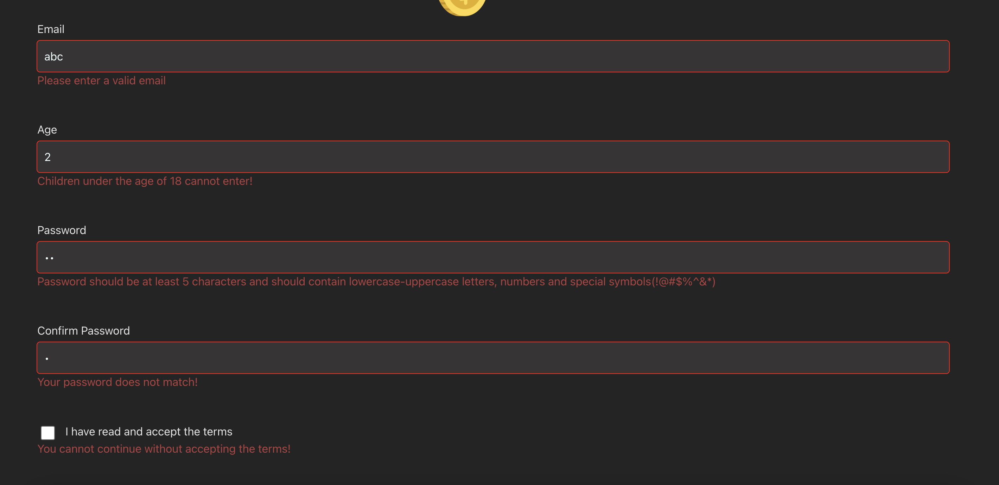

# MVC ( Model View Controller) Coin App

### MVC stands for Model-View-Controller, which is a software architectural pattern commonly used in developing user interfaces. Here's a brief overview of each component:

### Model : Represents the application's data and business logic. It encapsulates the data and behaviors of the application, providing an interface to manipulate and access the data.

- For example: Object-shaped values of a form whose state we keep in the project. {name:,mail: etc}

### View: The View is responsible for rendering the user interface. It presents the data from the Model to the user and sends user input to the Controller for processing. In web applications, the View is often HTML, CSS, and client-side scripts.

- JSX Codes are written here (div,form,header)

### Controller: The Controller acts as an intermediary between the Model and the View. It receives user input from the View, processes it (often by interacting with the Model), and updates the View accordingly. The Controller essentially handles the logic of the application flow.

- Functions and API requests that will run during user interaction are kept here.

# Technologies Used:

- API :https://api.coincap.io/v2/assets

- vite (`npm create vite`)

- Formik (`npm i formik`)

- yup (`npm i yup`)

- sass (`npm i sass`)

- Bootstrap

- RegEx

- uuid (`npm i uuid`)

- react-router-dom

- axios

- millify

- react-icons (`npm i react-icons`)

- react-chartjs-2(`npm i react-chartjs-2`)

- chart.js(`npm i chart.js`)

### I also saved the user information to the localStorage.

### Formik is the world's most popular open source form library for React and React Native.

### Yup allows us to verify the data in the form.

##SCREEN GIF

##SCREEN VIEW

